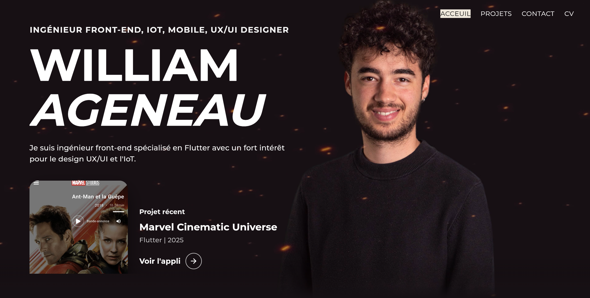
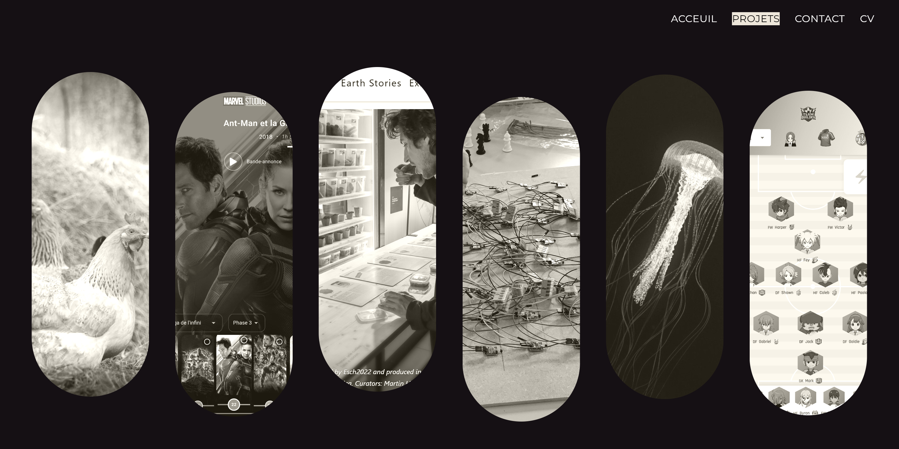

# William Ageneau – Portfolio Flutter

Bienvenue dans mon portfolio développé avec **Flutter**, accessible à l’adresse suivante :  
🌐 [williamageneauportfolio.go.yo.fr](http://williamageneauportfolio.go.yo.fr)

---

## 🎯 À propos du projet

Une application web/mobile responsive, conçue avec Flutter, pour présenter mes projets, compétences et parcours professionnel de façon dynamique et esthétique.

  

  

---

## ✨ Fonctionnalités principales

✅ Navigation fluide entre sections : Accueil, À propos, Projets, Contact  
✅ Design responsive : s’adapte à tous formats — mobile, tablette et desktop  
✅ Animations et transitions pour une interface moderne et engageante  
✅ Liens sociaux intégrés : GitHub, LinkedIn, etc.

